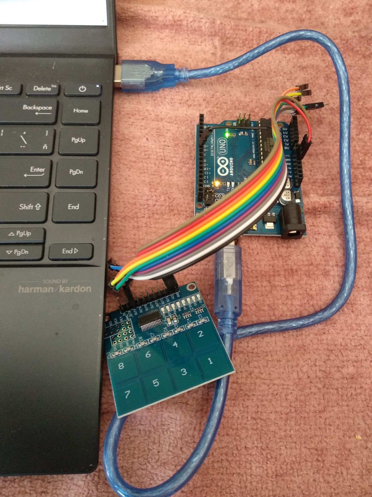

# pinpong_sandbox
## playing with arduino and pinpong python module
### LEDs and buttons

- **basic principle**
  > Serial communication between a computer with python and an arduino through the firmata protocol.
  > The pinpong library is able to install required firmware into an arduino board on its own.
  > You can solve the main logic in python, not in C, wiring or assembler. 
  >
- **HW installation**
  > Simply connect arduino board and a computer with USB cabel. OS recognizes new com port.
  > If doesn't there is probably any problem with drivers.
  >
  > *LEDs*
  >
  > You can use internal LED which is connected to port 13 or connect an external LED between any port you want and a ground pin.
  > A serial resistor is not needed because of limited current from arduino ports. 
  >
  > *buttons*
  >
  > I am using non mechanical touch modules in my examples. If you want to use normal mechanical buttons you must remember using
  > internal or external pulldown or [pullup resistor][1].
  >
  > [1]: <https://en.wikipedia.org/wiki/Pull-up_resistor> "pullup resistor"
  >
  > 
  >
  > There is an arduino uno with 8-port touch module in the picture.
  > Output 7 is connected to arduino pin 7. 
  
- **SW installation**

  > `pip install pinpong`
  >
  > `pip install ipython` (I like it and usually use it when developing any python code.)
  >
  > `pip list` shows installed modules
  > 
  > If ipython is installed and `ipython` command doesn't work try:
  >
  > `python -m IPython`

- **first test**
  
  > in python console write:
  >
  > `from pinpong.examples import blink`
  ```console
  >>> from pinpong.examples import blink
  
    __________________________________________
   |    ____  _       ____                    |
   |   / __ \(_)___  / __ \____  ____  ____ _ |
   |  / /_/ / / __ \/ /_/ / __ \/ __ \/ __ `/ |
   | / ____/ / / / / ____/ /_/ / / / / /_/ /  |
   |/_/   /_/_/ /_/_/    \____/_/ /_/\__, /   |
   |   v0.5.2  Designed by DFRobot  /____/    |
   |__________________________________________|
  
  [01] Python3.11.2 Windows-10-10.0.22631-SP0 Board: UNO
  selected -> board: UNO serial: COM6
  [10] Opening COM6
  [32] Firmata ID: 2.8
  [22] Arduino compatible device found and connected to COM6
  [40] Retrieving analog map...
  [42] Auto-discovery complete. Found 20 Digital Pins and 6 Analog Pins
  ------------------------------
  All right. PinPong go...
  ------------------------------
  ```
  > This example like any realtime application works in endless loop.
  > To end the loop you must press `ctrl + c`.
  >
  > In case of normal python console it is finished and you are then in a terminal.
  >
  > In case of ipython console it is not finished and due to it I like it more too.
  >
  > Inspect the code of the example. To see the path of the examples directory try this:
  ```
  >>> import pinpong
  >>> pinpong
  <module 'pinpong' from 'C:\\Users\\vysok\\AppData\\Local\\Programs\\Python\\Python311\\Lib\\site-packages\\pinpong\\__init__.py'>
  >>>
  ```
  > In windows it is obscure...
  > 
- **using button I**
  >
  > see [button_I.py][2]
  >
  > [2]: <https://github.com/JerryFox/pinpong_sandbox/blob/main/button_I.py> 
  >
  ```
  from pinpong.board import Board,Pin
  b = Board("uno").begin()
  led = Pin(13, Pin.OUT)
  but = Pin(7, Pin.IN)
  while True:
      val = but.value()
      led.value(val)
      print(val)
  ```
  >
  > But why too many outputs?!
  >

  
- **using button II**
  >
  > see [button_II.py][3]
  >
  > [3]: <https://github.com/JerryFox/pinpong_sandbox/blob/main/button_II.py> 
  >
  ```
  from pinpong.board import Board,Pin
  b = Board("uno").begin()
  led = Pin(13, Pin.OUT)
  but = Pin(7, Pin.IN)
  but_status = 0
  while True:
      val = but.value()
      if val != but_status: 
          led.value(val)
          print(val)
          but_status = val
  ```
  >
  > If you can switch the led on every button press make simple changes.
  >
  > see [button_IIa.py][4]
  >
  > [4]: <https://github.com/JerryFox/pinpong_sandbox/blob/main/button_IIa.py> 
  >
  ```
  from pinpong.board import Board,Pin
  b = Board("uno").begin()
  led = Pin(13, Pin.OUT)
  but = Pin(7, Pin.IN)
  but_status = 0
  led_status = 0
  while True:
      val = but.value()
      if val != but_status: 
          print(val)
          but_status = val
          if val: 
              led_status = not led_status
              led.value(led_status)
  ```
  >
  > In this case the led status changes on the button press. Try to change the code to switch the status on the button release.
  > 
- **blinking without delay**
  >
  > When you need to blink with a led and test a button value in every moment you can't use a sleep() function
  > because it stops execution of the python code. How to do it?
  >
  > You have to refresh the led state in the timeline. Imagine that the endless loop is executed many times per second.
  > You have to see if there is the right time to switch the led on or off. 
  >
  > I prepared two possible solutions. One is [blink_without_sleep_glob.py][5] with a function for blinking
  > and global variables. This solution is IMHO very ugly. Imagine you need to manage more leds and/or buttons.
  > This vision is horrible.
  >
  > So so acceptable thanks to python concept of dictionaries is [blink_without_sleep_dict.py][6]
  > but again nothing special. 
  >
  >[5]: <https://github.com/JerryFox/pinpong_sandbox/blob/main/blink_without_sleep_glob.py> 
  >[6]: <https://github.com/JerryFox/pinpong_sandbox/blob/main/blink_without_sleep_dict.py> 
  >
  ```
  from pinpong.board import Board,Pin
  import time
  
  def blink(l):
      now_time = time.time()
      if l["blink_status"]:
          if (not l["led_status"] and now_time - l["last_change"] > l["blink_off_time"])\
                or (l["led_status"] and now_time - l["last_change"] > l["blink_on_time"]):
              l["led_status"] = not l["led_status"] 
              l["led"].value(l["led_status"])
              l["last_change"] = now_time
  
  b = Board("uno").begin()
  led1 = {}
  led1["led"] = Pin(Pin.D13, Pin.OUT)
  led1["led_status"] = 0
  led1["blink_on_time"] = 0.2
  led1["blink_off_time"] = 1
  led1["last_change"] = 0
  led1["blink_status"] = True
  but = Pin(7, Pin.IN)
  but_status = 0
  while True:
      val = but.value()
      blink(led1)
      if val != but_status:
          print(val)
          but_status = val
          if val == 1:
              led1["blink_status"] = not led1["blink_status"]
  ```
  >
  >
- **using OOP advantages**
  > In [Object-oriented programing][7] are using objects in which are stored data (properties) and functions (methods)
  > together. It is suitable for us.
  > 
  > [7]: <https://en.wikipedia.org/wiki/Object-oriented_programming>
